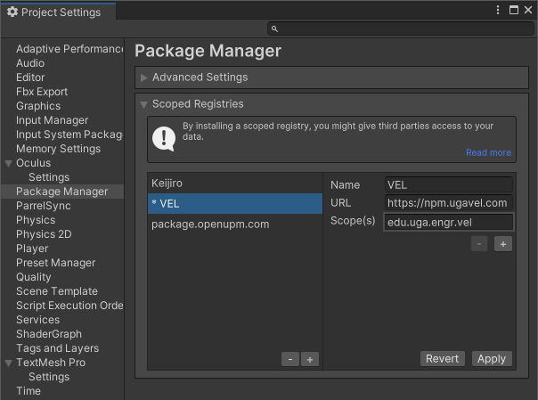

# VelUtils

VelUtils is a collection of utility scripts useful for VR Unity projects.

## Installation

Install the UPM package in Unity:

=== "**Option 1:** Add the VEL package registry"

    { align=right }

    Using the scoped registry allows you to easily install a specific version of the package by using the Version History tab.

    - In Unity, go to `Edit->Project Settings...->Package Manager`
    - Under "Scoped Registries" click the + icon
    - Add the following details, then click Apply
        - Name: `VEL` (or anything you want)
        - URL: `https://npm.ugavel.com`
        - Scope(s): `edu.uga.engr.vel`
    - Install the package:
        - In the package manager, select `My Registries` from the dropdown
        - Install the `VelUtils` package.

=== "**Option 2:** Add the package by git url"

    1. Open the Package Manager in Unity with `Window->Package Manager`
    - Add the local package:
        - `+`->`Add package from git URL...`
        - Set the path to `https://github.com/velaboratory/VelUtils`

    To update the package, click the `Update` button in the Package Manager, or delete the `packages-lock.json` file.

=== "**Option 3:** Add the package locally"

    1. Clone the repository on your computer:
        `git clone git@github.com:velaboratory/VelUtils.git`
    - Open the Package Manager in Unity with `Window->Package Manager`
    - Add the local package:
        - `+`->`Add package from disk...`
        - Set the path to `VelUtils/package.json` on your hard drive.

    To update the package, use `git pull` in the VelUtils folder.

!!! danger "Note"

    If you are encountering this error: `Library\PackageCache\edu.uga.engr.vel.velutils@3.0.2\Runtime\Input\InputModuleXR.cs(168,9): error CS0656: Missing compiler required member 'Microsoft.CSharp.RuntimeBinder.CSharpArgumentInfo.Create'`, go to Project Settings->Player->Other Settings and change Api Compatibility Level from ".NET Standard 2.1" to ".NET Framework".

Then check out the [samples](guide/samples.md), or follow the [quick start](guide/quick-start.md).